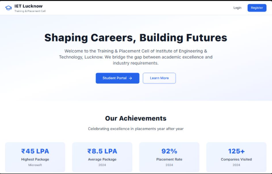

# College Placement Website – Frontend

<p align="center">
  
</p>


---

## **Project Overview**

This is the **frontend** of the Placement Website for a college, designed to help students access all placement-related information in one place.

The website provides:

* **Placement Calendar:** Track all company placement drives with dates and eligibility.
* **Company Info:** Detailed information about companies visiting the campus.
* **Blogs from Seniors:** Guidance and tips for juniors written by senior students.
* **User-friendly Interface:** Clean, responsive design optimized for desktop and mobile devices.

The project is built using:

* **Vite** – for fast development and optimized builds.
* **TypeScript** – for type safety and better maintainability.
* **React (assumed)** – to manage UI components effectively.

---

## **Features**

| Feature            | Description                                                               |
| ------------------ | ------------------------------------------------------------------------- |
| Placement Calendar | View upcoming placement drives with company details, date, and venue.     |
| Company Info       | Browse detailed information about companies visiting campus.              |
| Blogs & Tips       | Read blogs written by seniors to guide juniors for placement preparation. |
| Responsive Design  | Works smoothly on desktop, tablet, and mobile devices.                    |
| Fast & Modern      | Built using Vite with TypeScript for a high-performance frontend.         |

---

## **Getting Started**

### **Prerequisites**

* Node.js (v16+ recommended)
* npm or yarn

### **Installation**

```bash
# Clone the repository
git clone https://github.com/yourusername/college-placement-frontend.git

# Navigate to the project directory
cd college-placement-frontend

# Install dependencies
npm install
# or
yarn install
```

### **Running the Project**

```bash
# Start development server
npm run dev
# or
yarn dev
```

Open [http://localhost:5173](http://localhost:5173) in your browser to see the app running.

### **Building for Production**

```bash
npm run build
# or
yarn build
```

---

## **Technologies Used**

* **Vite** – Frontend build tool.
* **TypeScript** – Type-safe JavaScript.
* **React** – UI library (if applicable).
* **CSS / Tailwind / SCSS** – Styling (replace with what you used).

---

## **Future Enhancements**

* User authentication for students and admin.
* Search and filter for company drives and blogs.
* Notifications for upcoming placement events.
* Integration with backend APIs for real-time updates.

---
